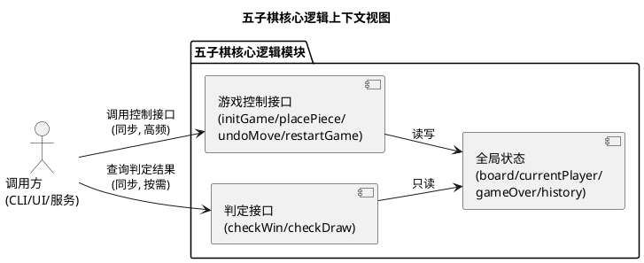
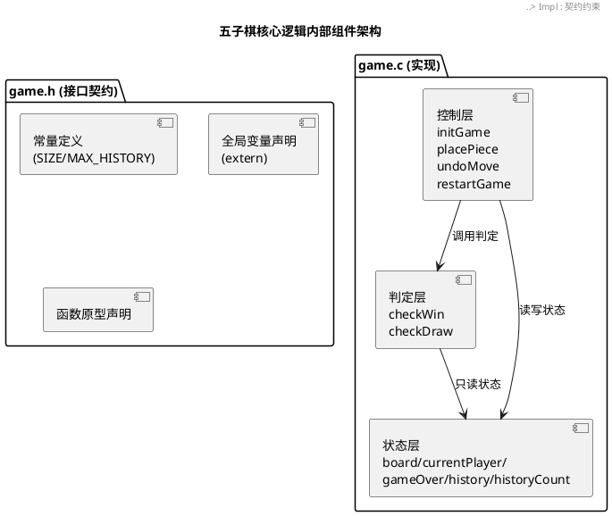
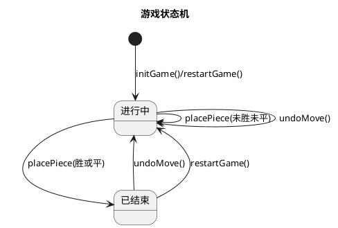
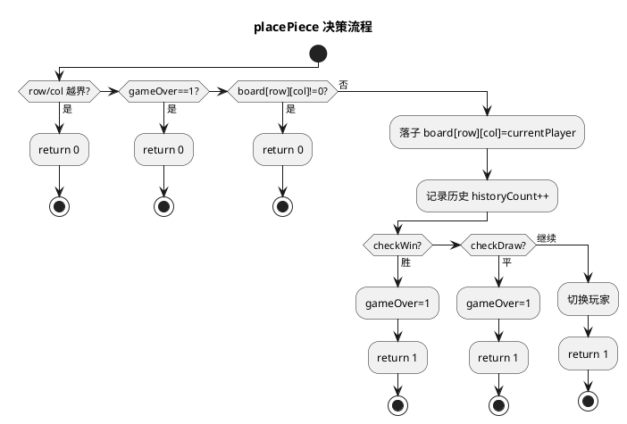
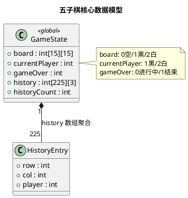

# 五子棋核心逻辑实现方案设计文档（design.md）

> 本文档基于原始需求与已实现的 `game.h`（40 行）/ `game.c`（144 行）编写，采用 C 语言、单模块双文件结构，描述技术架构、模块划分、关键算法、数据结构、接口设计、边界条件处理及 C 语言特性考量。

---

# 一、需求与存量功能关系分析

## 1.1 需求功能与存量功能对比

### 1.1.1 已实现功能

| 需求功能 | 存量功能 | 代码位置 | 匹配度 |
|---------|---------|---------|--------|
| `#define SIZE 15` 棋盘大小 | 已定义 `SIZE 15`，并额外定义 `MAX_HISTORY 225` | game.h:4-5 | 100% |
| `extern int board[SIZE][SIZE]` 棋盘（0空/1黑/2白） | 已声明并定义，语义一致 | game.h:8 / game.c:4 | 100% |
| `extern int currentPlayer`（1黑先行） | 已声明并定义，`initGame` 中置 1 | game.h:11 / game.c:5 | 100% |
| `extern int gameOver`（0进行中/1结束） | 已声明并定义，落子胜负/平局后置 1 | game.h:14 / game.c:6 | 100% |
| `extern int history[225][3]` 历史记录 | 改用 `history[MAX_HISTORY][3]`，更规范 | game.h:17 / game.c:7 | 100% |
| `extern int historyCount` 历史步数 | 已声明并定义，随落子自增、悔棋自减 | game.h:20 / game.c:8 | 100% |
| `void initGame()` 初始化游戏 | 棋盘清零、玩家置1、状态置0、步数置0 | game.c:11-22 | 100% |
| `int placePiece(int row,int col)` 落子 | 边界/空位/结束三重校验，记录历史，判胜/平，切换玩家 | game.c:25-65 | 100% |
| `int checkWin(int row,int col,int player)` 检查胜利 | 以落子点为中心四方向双向延伸，连5即胜 | game.c:69-102 | 100% |
| `void undoMove()` 悔棋 | 弹出历史、棋盘置空、恢复玩家、状态置0 | game.c:105-124 | 100% |
| `void restartGame()` 重新开始 | 直接调用 `initGame()` | game.c:127-130 | 100% |
| `int checkDraw()` 检查平局 | 遍历棋盘，存在空位返回0，全满返回1 | game.c:133-144 | 100% |
| 头文件保护 | 已使用 `#ifndef GAME_H/#define GAME_H/#endif` | game.h:1-2,40 | 100% |

### 1.1.2 需要扩展的功能

| 需求功能 | 存量功能 | 差异说明 | 扩展方向 |
|---------|---------|---------|---------|
| `placePiece` 仅要求"调用 checkWin" | 实现中额外调用了 `checkDraw` 并在平局时置 `gameOver=1` | 输出行为差异：原需求未明确平局处理时机，实现做了合理增强 | 无需改动，属正向增强；可在接口文档中明确"落子即判平局"契约 |
| 历史数组容量 `225` | 使用宏 `MAX_HISTORY` | 表达方式差异：硬编码→符号常量 | 无需改动，已为更优实现 |

### 1.1.3 需要新增的功能或接口

原始需求范围内的功能已全部实现，无新增接口需求。

> 以下为可选的增强建议（非需求强制，列入增量设计供后续评估）：
> - **长连禁手判定**：标准五子棋规则中"六子及以上长连"的胜负判定策略（当前实现采用 `count >= 5`，即长连也算胜）。
> - **落子结果细分返回码**：当前 `placePiece` 仅返回 0/1，可将失败原因（越界/已占用/已结束）细分为不同错误码，便于上层 UI 给出精确提示。
> - **历史步数上限保护**：`placePiece` 中 `history[historyCount]` 写入前未显式校验 `historyCount < MAX_HISTORY`（理论上棋盘满 225 步前必已平局，逻辑安全，但显式校验更具防御性）。

## 1.2 存量功能详细分析

### 1.2.1 initGame()

- **接口契约**：入参无；出参无；副作用为重置全部全局状态。
- **业务规则**：双层循环将 `board` 全部置 0；`currentPlayer=1`（黑先）；`gameOver=0`；`historyCount=0`。
- **扩展点**：无；如需自定义初始局面可在此扩展。
- **约束**：时间复杂度 O(SIZE²)；无并发安全考量（单线程模型）。

### 1.2.2 placePiece(int row, int col)

- **接口契约**：入参 `row,col`（棋盘坐标）；出参 `int`（1 成功，0 失败）；副作用为修改 `board`、`history`、`historyCount`、`currentPlayer`、`gameOver`。
- **业务规则**（顺序校验，短路返回）：
  1. 边界校验：`row/col` 越界 → 返回 0；
  2. 状态校验：`gameOver==1` → 返回 0；
  3. 占用校验：`board[row][col]!=0` → 返回 0；
  4. 落子：`board[row][col]=currentPlayer`；
  5. 记录历史并 `historyCount++`；
  6. 调用 `checkWin`，胜则 `gameOver=1` 返回 1；
  7. 调用 `checkDraw`，平则 `gameOver=1` 返回 1；
  8. 切换玩家 `currentPlayer = (1?2:1)`，返回 1。
- **扩展点**：可在校验通过后、落子前插入"禁手判定"钩子。
- **约束**：校验顺序不可调换（边界优先避免越界访问）；胜负判定后不再切换玩家。

### 1.2.3 checkWin(int row, int col, int player)

- **接口契约**：入参 `row,col,player`；出参 `int`（1 胜，0 未胜）；无副作用（纯查询）。
- **业务规则**：以 `(row,col)` 为中心，对 4 个方向 `{水平,垂直,主对角线,副对角线}` 分别向正、反两侧延伸统计同色连子数（含中心点），任一方向 `count>=5` 即返回 1。
- **扩展点**：判定阈值 5 可参数化以支持不同棋类；`count>=5` 可改为 `==5` 以适配"长连禁手"规则。
- **约束**：延伸时逐格做边界检查，避免数组越界；时间复杂度 O(1)（最多扫描 4×8 格）。

### 1.2.4 undoMove()

- **接口契约**：入参无；出参无；副作用为回退一步状态。
- **业务规则**：`historyCount<=0` 直接返回；否则 `historyCount--`，读取被弹出步骤的 `row,col,player`，`board[row][col]=0`，`currentPlayer=player`，`gameOver=0`。
- **扩展点**：可扩展为支持多步连续悔棋或限制悔棋次数。
- **约束**：恢复的玩家为"被悔棋那一手的执棋方"，保证下一次仍由该方落子；强制 `gameOver=0` 使已结束游戏可继续。

### 1.2.5 restartGame()

- **接口契约**：入参无；出参无；副作用等价于 `initGame()`。
- **业务规则**：直接转发调用 `initGame()`。
- **约束**：无独立逻辑，保持与初始化语义一致。

### 1.2.6 checkDraw()

- **接口契约**：入参无；出参 `int`（1 平局，0 未平）；无副作用。
- **业务规则**：遍历全棋盘，遇任意 `board[i][j]==0` 立即返回 0；遍历结束返回 1。
- **约束**：时间复杂度 O(SIZE²)；早退优化使非平局场景平均开销更低。

### 1.2.7 全局状态约束

- **生命周期**：`board/currentPlayer/gameOver/history/historyCount` 为全局变量，程序级生命周期，跨函数共享。
- **一致性**：`historyCount` 必须与 `history` 有效记录数、`board` 非空格数保持一致；`currentPlayer` 仅在合法落子后切换。
- **线程安全**：非线程安全，设计面向单线程交互场景。

---

# 二、增量设计方案

## 2.1 实现模型

### 2.1.1 上下文视图

本模块为五子棋核心逻辑库，不包含 UI 与持久化，通过 C 接口被上层调用方（如命令行 UI、图形界面、网络对战服务）调用。

- **上游调用方**：CLI / GUI / 网络服务，通过 `#include "game.h"` 链接 `game.c` 调用。
- **下游依赖**：无外部依赖，仅依赖 C 标准库语义（无显式 `#include`）。
- **通信协议**：C 函数调用（同步、进程内）。

### 2.1.2 服务/组件总体架构

模块内部按职责划分为三部分：**控制层**（驱动游戏流程）、**判定层**（胜负/平局计算）、**状态层**（全局数据持有）。

- **控制层**：负责流程编排与状态变更，是唯一会修改 `currentPlayer/gameOver/historyCount` 的层。
- **判定层**：纯查询，不修改任何状态，可被控制层或外部直接调用。
- **状态层**：全局变量集合，被两层共享访问。
- **配置项**：`SIZE`（棋盘尺寸，默认 15）、`MAX_HISTORY`（历史容量，默认 SIZE²）。

### 2.1.3 实现设计文档

#### 游戏状态机

游戏整体状态由 `gameOver` 与 `historyCount` 隐式驱动，状态流转如下：

#### 落子流程分支

`placePiece` 内部决策分支（活动图）：

#### 胜利判定算法设计

采用"以最新落子点为中心、四方向双向延伸"的增量判定法，而非全棋盘扫描：
- 仅需检查刚落子点参与的 4 条线（水平、垂直、主对角线、副对角线）；
- 每条线向正、反两侧延伸统计同色连子，含中心点；
- 任一方向连子数 ≥5 即判胜；
- 复杂度 O(1)（最多 32 次比较），显著优于全盘扫描 O(SIZE²×4)。

## 2.2 接口设计

### 2.2.1 总体设计

| 接口 | 类别 | 层级 | 稳定性 | 说明 |
|------|------|------|--------|------|
| `initGame` | 控制 | 控制层 | 稳定 | 初始化/重置全局状态 |
| `placePiece` | 控制 | 控制层 | 稳定 | 落子主入口，驱动流程 |
| `undoMove` | 控制 | 控制层 | 稳定 | 悔棋回退一步 |
| `restartGame` | 控制 | 控制层 | 稳定 | 重开（转发 initGame） |
| `checkWin` | 判定 | 判定层 | 稳定 | 胜负判定（可独立调用） |
| `checkDraw` | 判定 | 判定层 | 稳定 | 平局判定（可独立调用） |

- **命名规范**：统一采用 camelCase，与需求及用户偏好一致。
- **接口变更策略**：当前为稳定契约；若引入禁手/错误码细分，采用新增函数而非修改现有签名，保持向后兼容。

### 2.2.2 接口清单

#### initGame

- **签名**：`void initGame(void);`
- **业务说明**：重置棋盘、玩家、状态、历史，进入"黑棋先行、进行中"的初始局面。
- **前置条件**：无。
- **后置条件**：`board` 全 0；`currentPlayer=1`；`gameOver=0`；`historyCount=0`。
- **异常映射**：无异常（C 语言）。
- **调用示例**：`initGame();`

#### placePiece

- **签名**：`int placePiece(int row, int col);`
- **业务说明**：当前玩家在 `(row,col)` 落子；成功后自动判胜/平并切换玩家。
- **前置条件**：建议先调用 `initGame` 完成初始化（否则全局变量为未初始化的 >0 零值，C 静态区保障为 0，但显式初始化更安全）。
- **后置条件**：成功时 `board[row][col]` 被占用、`historyCount` 自增；胜负/平局时 `gameOver=1` 且不切换玩家；继续时切换玩家。
- **异常映射**：返回 0 表示失败（越界 / 已结束 / 已占用），返回 1 表示成功。
- **调用示例**：`if (placePiece(7, 7)) { /* 落子成功 */ }`

#### checkWin

- **签名**：`int checkWin(int row, int col, int player);`
- **业务说明**：判定以 `(row,col)` 为中心、`player` 方的四方向是否存在连5。
- **前置条件**：`(row,col)` 应为合法坐标；`player` 应为 1 或 2。
- **后置条件**：无状态变化。
- **异常映射**：返回 1 胜，0 未胜。
- **调用示例**：`if (checkWin(7, 7, 1)) { /* 黑胜 */ }`

#### undoMove

- **签名**：`void undoMove(void);`
- **业务说明**：悔最近一步棋，恢复棋盘、玩家与进行中状态。
- **前置条件**：`historyCount > 0`（无历史时为空操作）。
- **后置条件**：`historyCount` 自减；对应格置空；`currentPlayer` 恢复为该步执棋方；`gameOver=0`。
- **异常映射**：无（空历史时静默返回）。
- **调用示例**：`undoMove();`

#### restartGame

- **签名**：`void restartGame(void);`
- **业务说明**：重新开始一局，等价于 `initGame`。
- **前置条件**：无。
- **后置条件**：同 `initGame`。
- **异常映射**：无。
- **调用示例**：`restartGame();`

#### checkDraw

- **签名**：`int checkDraw(void);`
- **业务说明**：判定棋盘是否已满（平局）。
- **前置条件**：无。
- **后置条件**：无状态变化。
- **异常映射**：返回 1 平局，0 未平。
- **调用示例**：`if (checkDraw()) { /* 平局 */ }`

## 2.3 数据模型

### 2.3.1 设计目标

- **支持的业务场景**：15×15 五子棋单局对弈，含落子、胜负判定、平局判定、悔棋、重开。
- **性能目标**：落子+判定 O(1)～O(SIZE²)（平局判定最坏全盘扫描，可接受）；空间 O(SIZE²)。
- **容量目标**：棋盘 225 格，历史最多 225 步。
- **兼容策略**：全局变量模型面向单进程单局对弈；如需多局并行，需将全局状态封装为结构体实例（见 2.3.2 演进建议）。

### 2.3.2 模型实现

核心领域对象为"棋局状态"，由若干全局变量联合表达：

- **对象关系**：`history` 为 `HistoryEntry` 的数组聚合（C 中以 `int[225][3]` 实现，每行即一条历史记录）。
- **创建/销毁策略**：全局变量具备程序级生命周期，自动分配于静态存储区，无需手动管理；`initGame` 负责逻辑重置。
- **持久化策略**：当前无持久化；如需存档可将 `board/history/historyCount/currentPlayer` 序列化为文件或字节流。

### 2.3.3 C 语言特性考量

| 维度 | 现状 | 评估/建议 |
|------|------|-----------|
| **头文件保护** | `#ifndef GAME_H/#define GAME_H/#endif` | 已正确使用，防止重复包含 |
| **全局变量** | `board` 等定义为全局，`extern` 声明于头文件 | 单局场景合理；多局并行建议封装为 `typedef struct { ... } Game;` 并改为函数入参 |
| **数组越界** | `placePiece` 做边界校验；`checkWin` 延伸时逐格校验 | 已防护；`history` 写入依赖"平局先于写满"逻辑安全，建议显式加 `historyCount < MAX_HISTORY` 防御性校验 |
| **符号常量** | `SIZE`、`MAX_HISTORY` 用宏 | 优于硬编码，便于维护；C 中也可考虑 `enum` 或 `static const int`（但数组维度需宏/字面量） |
| **函数原型** | 全部声明于头文件，`void` 参数未显式写 `void` | C 中空参 `f()` 表示"接受任意参数"，严格起见可写 `f(void)`；当前不影响功能 |
| **未初始化全局变量** | 依赖静态区零初始化 | 安全，但建议程序入口显式调用 `initGame` 以语义清晰 |
| **类型安全** | 全部使用 `int` | 棋盘值域 {0,1,2}、坐标值域 [0,14]，可考虑引入枚举 `Piece {EMPTY=0, BLACK=1, WHITE=2}` 增强可读性与安全性 |
| **返回码语义** | `placePiece` 0/1 合并多种失败原因 | 可演进为枚举错误码 `PLACE_OK/OUT_OF_BOUNDS/CELL_OCCUPIED/GAME_OVER` |
| **长连规则** | `count >= C` 判胜 | 与"无禁手自由五子棋"一致；标准竞赛规则需改为 `==5` 并处理长连禁手 |

### 2.3.4 可选增量演进路线

1. **错误码细化**：`placePiece` 返回枚举，便于上层精确提示。
2. **多实例支持**：将全局状态封装为结构体，函数增加 `Game*` 入参，支持多局并发。
3. **禁手规则**：增加标准竞赛规则下的"三三/四四/长连"禁手判定。
4. **持久化**：新增 `saveGame/loadGame` 接口，序列化棋局状态。
5. **复盘接口**：基于 `history` 提供逐步回放能力。

---

> **文档结束**。本设计已完整覆盖需求与存量实现分析、架构与组件划分、接口契约、数据模型及 C 语言特性考量，可作为后续实现与演进的依据。